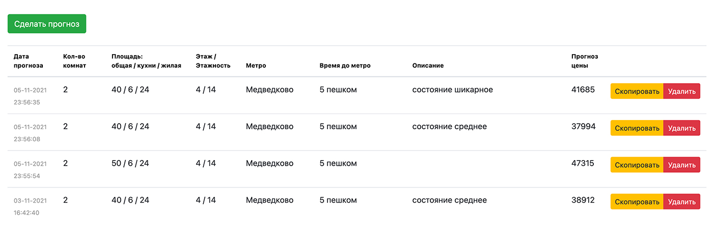

## Курсовой проект "Машинное обучение в бизнесе"

### Разработка web-приложения с использованием rest api на базе Flask для применения модели машинного обучения в прогнозировании стоимости аренды квартиры в Москве.
#### _Технологии: Flask, Vue.js, Docker-compose._ 


_Пример готового приложения [по ссылке](http://rental-price-prediction.adinweb.ru/)._

## Задачи проекта.

   Предварительно были спарсены данные о сдающихся квартирах в Москве с cian.ru (~24000 объектов). 
   Актуальность данных - весна 2021.

1. Собрать pipeline модели машинного обучения (преобразования данных + прогноз).
   
2. Обучить модель на данных с сайта cian.ru для прогнозирования стоимости аренды квартиры в Москве. 

3. Сохранить обученную модель (формат dill).

4. Настроить серверную часть (Flask) для применения сохраненной модели к новым данным по REST API - прогнозируем стоимость аренды квартиры по переданным параметрам в POST-запросе.

5. Разработать клиентскую часть (Vue.js) для возможности обращения к серверу и получения предсказаний модели через web-интерфейс.

6. Упаковать все в докер. Использовал docker-compose:
      - контейнеры для разработки "flask" + "vue";
      - контейнеры для прода "flask и nginx" + "vue".

7. Задеплоить на удаленном сервере ([готовый пример](http://rental-price-prediction.adinweb.ru/)).

<span style="color:red">В данном репозитории представлен код для для работы с уже сохраненной моделью (пункты 4-6): API серверной части (Flask), Web-интерфейс (Vue.js), упакованные в контейнеры с возможностью дальнейшей разработки или релиза в прод.</span>
<span style="color:blue">Обучение самой модели будет выложено в отдельном репозитории.</span>

## Установка через docker-compose.


```sh
$ git clone https://github.com/ZV8/Flask-vue-price-predict.git
$ cd Flask-vue-price-predict
```
### Далее, если запускаем **версию для разработки**:

```sh
$ docker-compose -f docker-compose-dev.yml up --build
```
После установки приложение будет доступно по ссылке: [http://localhost:8080](http://localhost:8080) или [http://0.0.0.0:8080](http://localhost:8080)

API доступно по адресу: [http://localhost:5000](http://localhost:5000)

GET - История предиктов на сервере: [http://localhost:5000/get-examples](http://localhost:5000/get-examples)

POST - выполнить предикт для объекта: [http://localhost:5000/predict](http://localhost:5000/predict)

### ... если запуск **в прод**, то:

```sh
$ docker-compose -f docker-compose-prod.yml up --build -d
```


*********************************


## Описание Pipeline модели.

### Используемые фичи и их предобработка.

#### StandardScaler:
- количество комнат
- общая площадь
- площадь кухни
- жилая площадь
- этаж
- этажность дома
- удаленность от метро


#### OneHotEncoder:
- метро
- тип удаленности от метро (пешком/транспотром)
  
#### Очистка текста + лемматизация + TFIDF:
- текстовое описание объекта

Используемый алгоритм для модели: XGBRegressor.

## Общие выводы и возможные улучшения.


   В целом, получилась простая, легковесная модель, которую можно использовать в проде в онлайн-режиме. Точность прогноза далека от идеала, но приемлемая для использования в качестве бейзлайна и выявления некоторых зависимостей стоимости от параметров объекта (в том числе его текстового описания).
   
   Главной целью проекта было показать пример применения модели в рабочей версии продукта с упаковкой кода в докер-контейнеры и максимально простого развертывания на сервере.
   
   #### Возможные улучшения качества прогноза модели: 
   
   - В основе лежит относительно небольшая выборка данных. Из-за этого некоторые фичи, такие как "метро", не достаточно влияют на прогноз. Как вариант, помимо увеличения исходного датасета, дополнительно предобработать и объединить метро в группы.
   - TFIDF для текста выделяет только значимые слова, но без учета контекста и связок. Отсюда такие варианты фраз как "В квартире требуется ремонт" и "Квартира после ремонта" при прочих равных значениях фичей дают одинаковый прогноз цены, что не является корректным. Как вариант, отдельно поработать с языковыми моделями, учитывающими контекст.


